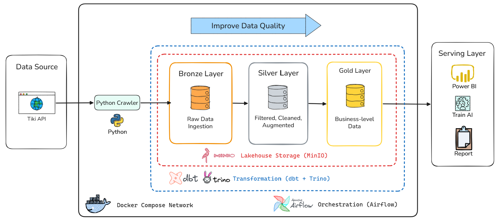
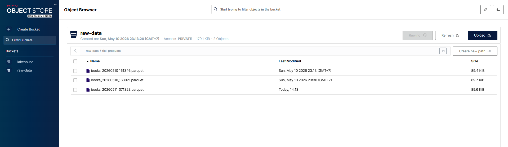
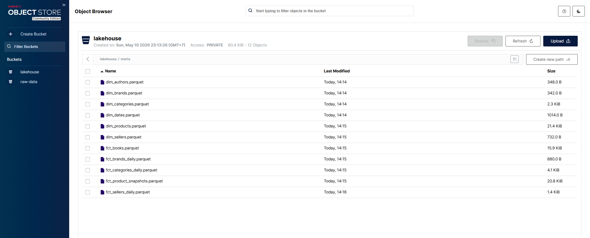
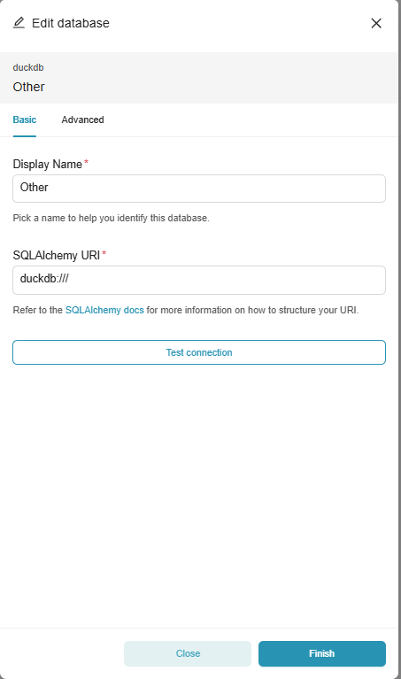
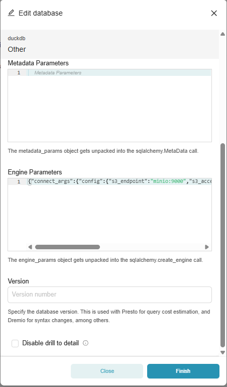
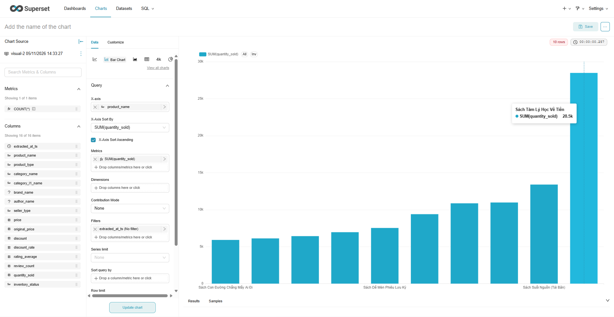
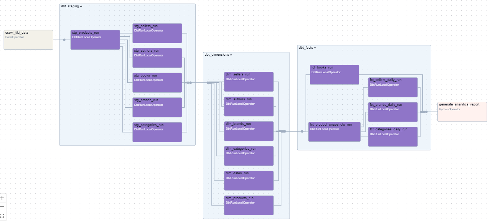
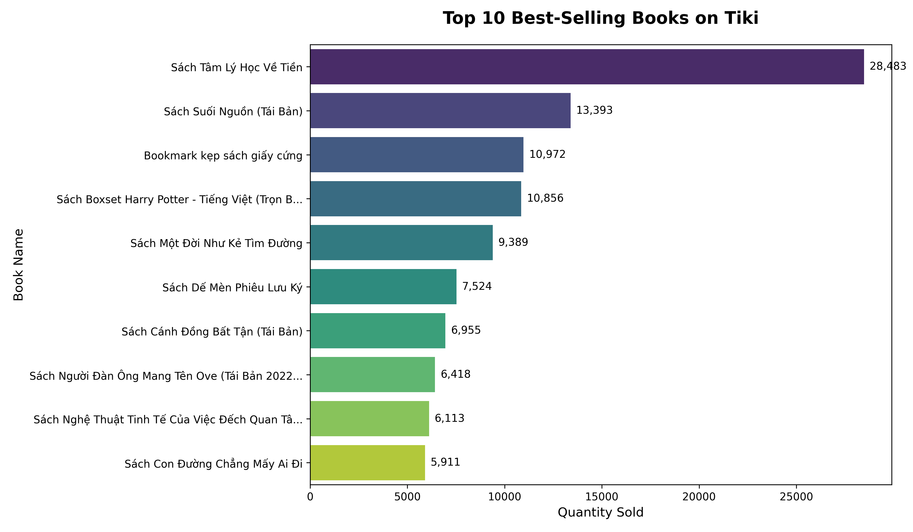

<div align="center">
  <h1>Tiki Lakehouse Project 🌊🛒</h1>
  <p><em>Modern local data platform for crawling, modeling, orchestrating, and visualizing Tiki.vn product data</em></p>

  []()
  []()
  []()
  []()
  []()
</div>


---

## 📖 Project Overview

This project implements a local **lakehouse-style modern data stack** that simulates an end-to-end e-commerce analytics workflow for Tiki.vn. It crawls product data, stores raw extracts in MinIO, transforms them with dbt and Trino/Iceberg, orchestrates the daily flow with Airflow, and serves curated data through Superset.

### Key Features
- **Automated Ingestion**: A custom crawler fetches Tiki product data from the public API and writes raw Parquet files to MinIO.
- **Medallion-Style Modeling**: dbt builds a clear Bronze → Silver → Gold flow with staging, intermediate, and mart models.
- **Lakehouse Storage**: Apache Iceberg tables backed by MinIO S3-compatible object storage and tracked via a JDBC catalog on PostgreSQL.
- **Orchestration**: Airflow runs the daily pipeline from ingestion to analytics.
- **Visualization**: Apache Superset is used for interactive dashboards and exploration.
- **Analytics Output**: A Trino-based script generates a top-selling-books chart in the local assets folder.
- **Developer Friendly**: `uv`, `Makefile` targets, and Docker Compose keep the workflow reproducible on a laptop.

## 🛠️ Tech Stack & Architecture

<div align="center">
	
</div>

| Layer | Component | Technology | Description |
| :--- | :--- | :---: | :--- |
| **Ingestion** | Crawler | 🐍 Python | Fetches product listings from the Tiki API and stores raw extracts as Parquet files. |
| **Storage** | Object Store | 🪣 MinIO | Hosts the raw Bronze data and curated lakehouse outputs. |
| **Transform** | Data Modeling | 🔨 dbt + Trino (Iceberg) | Cleans and models the raw data into staging and mart layers. |
| **Orchestration** | Scheduler | 🌬️ Airflow | Runs the daily crawl → dbt → analytics workflow. |
| **Visualization** | BI Tool | 📊 Superset | Connects to Trino for dashboarding and ad hoc analysis. |
| **Analytics** | Reporting | 📈 Trino + Matplotlib | Produces local analysis charts from curated mart tables. |

## 📂 Project Structure

```text
tiki-lakehouse-pipeline/
├── airflow_home/            # Local Airflow metadata and runtime files
├── assets/                  # Static outputs and generated analytics charts
├── crawler/                 # Tiki ingestion scripts
├── dags/                    # Airflow DAG definitions
├── dbt_tiki/                # dbt project for Silver/Gold modeling
├── logs/                    # Project-level logs
├── preview_data/            # Local CSV previews generated by the crawler
├── src/                     # Shared Python helpers
├── docker-compose.yaml      # Local infrastructure stack (MinIO, PostgreSQL, Trino, Superset)
├── Makefile                 # Common developer commands
├── run_airflow.sh           # Airflow standalone launcher
├── run_project.sh           # End-to-end convenience script
├── pyproject.toml           # Python project metadata and dependencies
└── README.md                # Project documentation
```

## 🚀 Getting Started

### 1. Prerequisites
- Linux
- Python 3.10 or newer
- Docker and Docker Compose
- `uv` installed on the host machine

### 2. Prepare Environment

```bash
cp .env.example .env
```

Adjust `.env` if you want to change credentials, ports, or local paths.

### 3. Install Dependencies

```bash
make setup
```

This creates the virtual environment, installs Python dependencies, and configures pre-commit hooks.

### 4. Start Infrastructure

```bash
make run
```

This starts MinIO, PostgreSQL (for Iceberg catalog & Superset backend), Trino, and Superset with Docker Compose.

### 5. Run the Pipeline

```bash
make crawl
# Setup raw tables schema in Trino
uv run python src/setup_raw_table.py
# Run dbt transformations
make dbt-run
# Generate local analytics chart
make analytics
```

If you want the Airflow-managed version of the workflow, start standalone Airflow with:

```bash
make airflow
```

## 🔗 Monitoring & Access

| Service | URL | Credentials |
| :--- | :--- | :--- |
| **MinIO Console** | `http://localhost:9001` | Defined in `.env` |
| **MinIO API** | `http://localhost:9000` | S3-compatible endpoint |
| **Trino Server** | `http://localhost:8080` | User: `trino` |
| **Superset** | `http://localhost:8088` | Defined in `.env` |
| **Airflow Webserver** | `http://localhost:8081` | Standalone local mode |

The exact passwords and usernames are loaded from `.env`, which can be created from `.env.example`.

## 📊 Data Pipeline Flow

1. **Bronze Layer**: `crawler/fetch_tiki.py` fetches product data from Tiki.vn, normalizes nested fields for Parquet compatibility, and uploads raw extracts to the MinIO `raw-data` bucket under `tiki_products/`.
2. **Silver Layer**: dbt staging models in `dbt_tiki/models/staging/` read the raw Parquet files from MinIO through Trino, clean the fields, and standardize types for downstream modeling.
3. **Gold Layer**: dbt mart models in `dbt_tiki/models/marts/` build dimensional and fact outputs as Apache Iceberg tables in the lakehouse storage layer.
4. **Serving Layer**: Superset connects to the lakehouse outputs via Trino engine for visualizations.
5. **Analytics Layer**: `src/analytics_plot.py` reads curated marts through Trino and writes local chart outputs to `assets/analytics/`.

## 🌬️ Airflow Orchestration

The main DAG is `tiki_lakehouse_daily_pipeline`.

Typical task flow:

- `crawl_tiki_data`
- `run_dbt_transformation`
- `generate_analytics_report`

The DAG is implemented in [dags/tiki_lakehouse_pipeline.py](dags/tiki_lakehouse_pipeline.py).

## 🛠️ Makefile Reference

| Command | Description |
| :--- | :--- |
| `make help` | Show all available commands |
| `make setup` | Create the virtual environment, install dependencies, and install hooks |
| `make venv` | Create the Python virtual environment |
| `make install` | Install dependencies from `uv.lock` |
| `make run` | Start the Docker infrastructure stack |
| `make stop` | Stop the Docker services |
| `make crawl` | Run the Tiki crawler |
| `make dbt-run` | Run dbt transformations |
| `make dbt-test` | Run dbt tests and validations |
| `make dbt-docs` | Generate and serve dbt documentation |
| `make analytics` | Generate the local analytics chart |
| `make lint` | Run Black, Flake8, and SQLFluff checks |
| `make format` | Format Python and SQL files |
| `make test` | Run crawler unit tests |
| `make airflow` | Start Airflow standalone mode |
| `make airflow-reset` | Reset local Airflow state |
| `make clean` | Remove local caches and generated files |
| `make clean-docker` | Remove Docker containers and volumes |
| `make clean-all` | Full cleanup of local artifacts and Docker state |

## 🖼️ Screenshots Gallery

The sections below are ready for you to drop in real screenshots later. Replace the placeholder images with your own files when they are available.

### 1. Sample Crawled Data


### 2. MinIO S3 Storage


### 3. Superset Connection & Dataset Setup
To connect Superset to Trino, use the following connection details:
- **Database**: Trino
- **SQLAlchemy URI**: `trino://trino@trino:8080/iceberg/gold`

<p align="center">
	
	
</p>
<p align="center">
	
</p>

### 4. Airflow DAG View


### 5. Analytics Output


## 📝 Notes

- Use `uv sync` after changing dependencies in `pyproject.toml`.
- Use `docker compose down` or `make stop` when you are done with the local stack.
- The marts are materialized as Iceberg tables in the lakehouse storage layer.

---

_Last updated: June 21, 2026_
