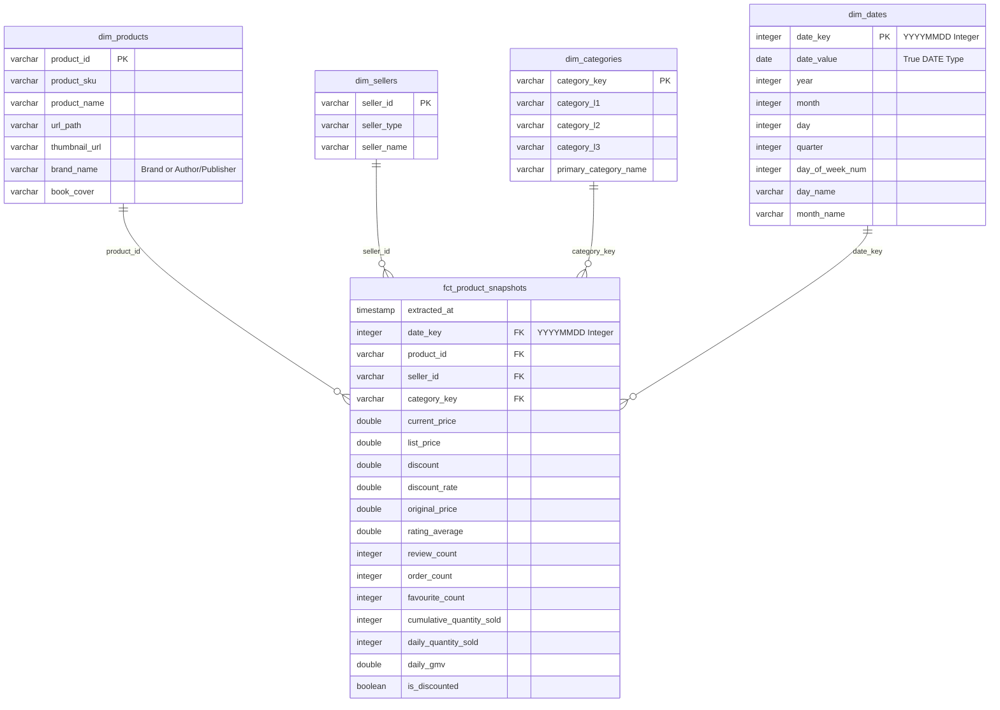

# Tiki Analytics Data Model Design (Star Schema for Power BI)

This document provides a detailed overview of the redesigned dimensional model (Star Schema) developed inside the Tiki Lakehouse. This structure is optimized specifically for Power BI, enabling intuitive dashboard building, auto-detected hierarchies, and advanced business analysis.

---

## 1. Dashboard Objectives & Audience (Business Requirements)

* **Target Audience**: Category Manager / Marketplace Sellers on Tiki.
* **Objective**: Market Intelligence Analysis and Competitor Monitoring.
* **Specific Use Cases Addressed**:
  * **a) Daily Market Volume & GMV**: Tracking daily fluctuations in estimated GMV and actual quantities sold.
  * **b) Market Share Analysis**: Segmenting market share percentage between different Sellers and Publishers/Authors (Company/Brand).
  * **c) Potential Product Discovery**: 
    * Identifying potential books (e.g., high average ratings but low sales counts).
    * Identifying trending books (fastest sales volume growth over a 7-day window).
  * **d) Pricing & Promotion Strategy**: Analyzing competitor price fluctuations, list price margins, and active discount distributions.

---

## 2. Schema Architecture Overview

The redesigned model transitions from a wide-flat structure to a classic **Kimball Star Schema**. This minimizes redundant data joins, creates clean single-direction filters, and leverages native calendar properties.

---